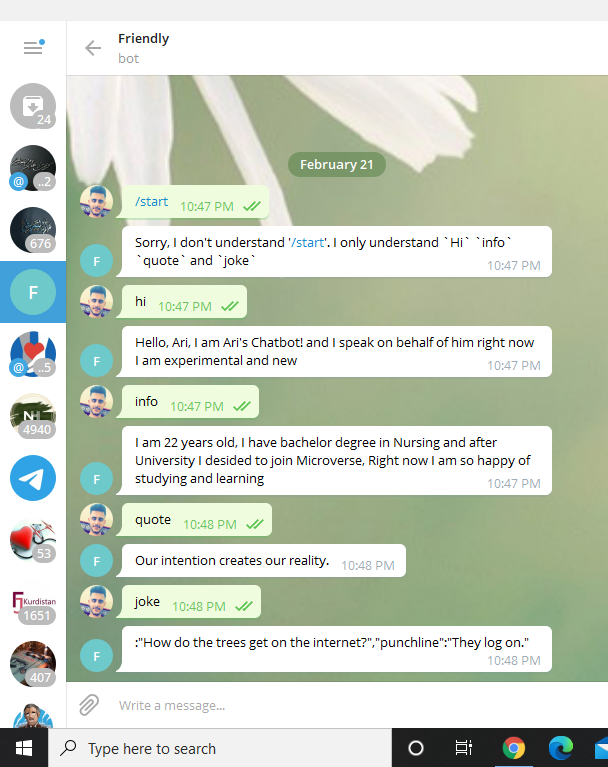
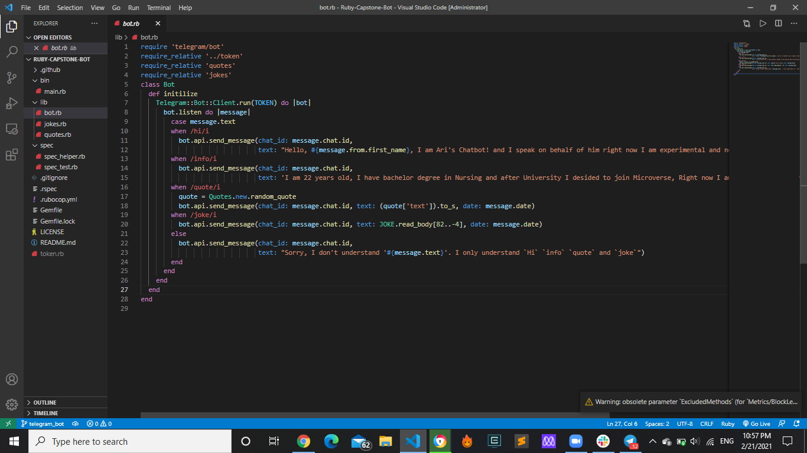

# TELEGRAM BOT

> In this project, I build a Telegram bot that gives a bit of information about me and gives random quotes.

## Built With

- Ruby
- The Telegram Bot API

## How to Install
- First, you need to get a telegram account at [Telegram](https://web.telegram.org)
- Once you have an account, search for @BotFather, the Telegram bot-making wizard. This should open a chat with the BotFather.
- Now type '/newbot' and send to start a new bot and follow the instructions. The BotFather will ask you to choose a username and give you an API token. Keep this token secret. It can be used to control your bot.
- Fork this repo and clone to your local machine.
- Cd into the repo and create a file in the main directory called 'config.rb'
- Inside config.rb, type 'TELEGRAM_TOKEN_ID' and set it equal to the API token you got from the BotFather. Make sure the API token is in quotes to make it a string.

- Make sure you have Bundler installed in your machine. Once in the project folder (top level director), enter the command `bundle install` in your terminal. This will install the basic dependencies in the Gemfile.

- Now the rest of the app should run. Go to your terminal, cd into the 'bin' directory of the repo, and enter the command `ruby main.rb`.

- The bot should run. If you search for your bot by its username in Telegram, it should be ready to receive commands. 

- Currently, the bot responds to the commands 'start', 'info', and 'quote'. 

- 'Start' will prompt the bot to give some basic info about itself.

- 'Info' will prompt the bot to give some basic info about the creator (me in this case).

- 'Quote' will prompt the bot to give a random inspirational quote.

- Of course, you can alter the messages and commands in ramsey_bot.rb to something you prefer.

## How to Run Tests

- If you ran `bundle install`, RSpec should be installed, along with all the other dependencies. To run the tests, cd into the top-level project folder and enter the command `rspec`. This will run all tests. It should be noted that the #make_request method is a private method, so its test will naturally fail. To make it pass, temporarily comment out the `private` keyword in the motivational_quotes.rb file. The tests should now pass. Once satisfied, uncomment it so that the #make_request method is private again.

## Authors

👤 **Ari Karim**

- Github: [@AriKarim](https://github.com/arikarim)
- Linkedin: [AriKarim](https://www.linkedin.com/in/ari-karim-523bb81b3)

## 🤝 Contributing

Contributions, issues and feature requests are welcome!

Feel free to check the [issues page](issues/).

## Show your support

Give a ⭐️ if you like this project!

## 📝 License

This project is [MIT](lic.url) licensed.